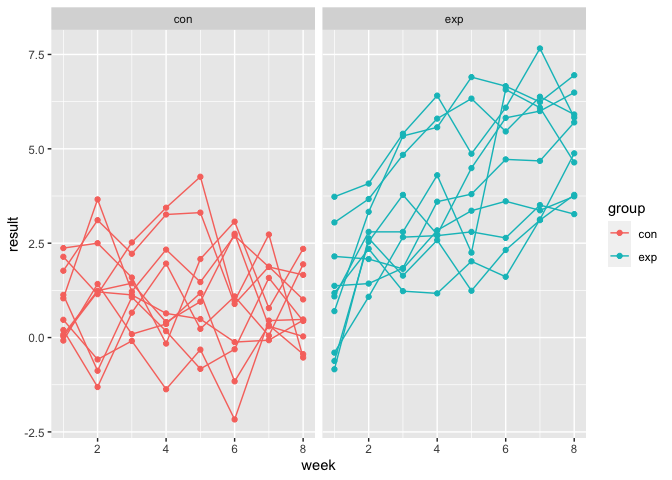

p8105\_hw5\_sz3030
================
Shaocong Zhang
11/20/2021

``` r
library(tidyverse)
```

    ## ── Attaching packages ─────────────────────────────────────── tidyverse 1.3.1 ──

    ## ✓ ggplot2 3.3.5     ✓ purrr   0.3.4
    ## ✓ tibble  3.1.4     ✓ dplyr   1.0.7
    ## ✓ tidyr   1.1.3     ✓ stringr 1.4.0
    ## ✓ readr   2.0.1     ✓ forcats 0.5.1

    ## ── Conflicts ────────────────────────────────────────── tidyverse_conflicts() ──
    ## x dplyr::filter() masks stats::filter()
    ## x dplyr::lag()    masks stats::lag()

``` r
library(purrr)
```

# Problem 2

## Start with a dataframe containing all file names; the list.files function will help

``` r
names_dtf = 
  tibble(
    file_names = list.files("./data/")
  )
```

## Iterate over file names and read in data for each subject using purrr::map and saving the result as a new variable in the dataframe

``` r
names_dtf = names_dtf %>%
  mutate(file_path = str_c("./data/", names_dtf$file_names),
         data = map(file_path, read_csv)
         ) %>%
  select(-file_path) %>%
  unnest()
```

## Tidy the result; manipulate file names to include control arm and subject ID, make sure weekly observations are “tidy”, and do any other tidying that’s necessary

``` r
names_dtf = 
  names_dtf %>%
  mutate(subject = str_replace(file_names, ".csv", ""),
         group = str_sub(file_names, 1, 3)) %>% 
  pivot_longer(cols = "week_1":"week_8",
               names_to = "week", 
               values_to = "result"
               ) %>% 
  mutate(
    week = str_replace(week, "week_", ""),
    week = as.numeric(week)
  ) %>%
  select(-file_names)
```

## Make a spaghetti plot showing observations on each subject over time, and comment on differences between groups.

``` r
names_dtf %>% 
  ggplot(aes(x = week, y = result, group = subject, color = group)) + 
  geom_point() + 
  geom_path() + 
  facet_grid(~group)
```

<!-- -->

It is obvious that the result values of the experiment group increase
linearly over time. Nearly all of the final result values of each
subject in the experiment group increase. However, subjects in the
control group have stable status as their result values don’t have
obvious changes over time.

What’s more, we can also conclude that subjects with high initial result
values usually end up with higher result values and subjects with low
initial result values usually end up with lower result values.

# Problem 3

## Load the dataset

``` r
set.seed(10)

iris_with_missing = iris %>% 
  map_df(~replace(.x, sample(1:150, 20), NA)) %>%
  mutate(Species = as.character(Species))
```

## Write function

``` r
fill_missing = function(vec){
  if (is.numeric(vec)) {
    mean_value = round(mean(vec, na.rm = TRUE), 1)
    vec = replace_na(vec, mean_value)
  }else if (is.character(vec)) {
    vec = replace_na(vec, "virginica")
  } else {
    stop("Cannot fill this type of missing values!")
  }
  return(vec)
}
```

## Apply this function to the columns of iris\_with\_missing using a map statement.

``` r
iris_data = 
  iris_with_missing %>%
  map(fill_missing) %>%
  as.tibble()

knitr::kable(iris_data)
```

| Sepal.Length | Sepal.Width | Petal.Length | Petal.Width | Species    |
|-------------:|------------:|-------------:|------------:|:-----------|
|          5.1 |         3.5 |          1.4 |         0.2 | setosa     |
|          4.9 |         3.0 |          1.4 |         0.2 | setosa     |
|          4.7 |         3.2 |          1.3 |         0.2 | setosa     |
|          4.6 |         3.1 |          1.5 |         1.2 | setosa     |
|          5.0 |         3.6 |          1.4 |         0.2 | setosa     |
|          5.4 |         3.9 |          1.7 |         0.4 | setosa     |
|          5.8 |         3.4 |          1.4 |         0.3 | setosa     |
|          5.0 |         3.4 |          1.5 |         0.2 | setosa     |
|          4.4 |         2.9 |          1.4 |         0.2 | setosa     |
|          4.9 |         3.1 |          3.8 |         0.1 | setosa     |
|          5.4 |         3.1 |          1.5 |         0.2 | setosa     |
|          4.8 |         3.4 |          1.6 |         0.2 | setosa     |
|          5.8 |         3.1 |          1.4 |         0.1 | setosa     |
|          4.3 |         3.0 |          3.8 |         0.1 | setosa     |
|          5.8 |         4.0 |          3.8 |         0.2 | setosa     |
|          5.7 |         4.4 |          1.5 |         0.4 | setosa     |
|          5.4 |         3.9 |          1.3 |         0.4 | setosa     |
|          5.1 |         3.5 |          1.4 |         1.2 | setosa     |
|          5.7 |         3.8 |          1.7 |         0.3 | setosa     |
|          5.1 |         3.8 |          1.5 |         1.2 | setosa     |
|          5.4 |         3.4 |          1.7 |         0.2 | setosa     |
|          5.1 |         3.7 |          1.5 |         0.4 | virginica  |
|          4.6 |         3.6 |          1.0 |         0.2 | setosa     |
|          5.8 |         3.3 |          3.8 |         0.5 | setosa     |
|          4.8 |         3.4 |          1.9 |         0.2 | virginica  |
|          5.0 |         3.0 |          3.8 |         0.2 | setosa     |
|          5.0 |         3.4 |          1.6 |         0.4 | virginica  |
|          5.2 |         3.5 |          1.5 |         0.2 | setosa     |
|          5.8 |         3.4 |          1.4 |         0.2 | setosa     |
|          4.7 |         3.2 |          1.6 |         0.2 | setosa     |
|          4.8 |         3.1 |          3.8 |         0.2 | setosa     |
|          5.4 |         3.1 |          1.5 |         0.4 | setosa     |
|          5.2 |         3.1 |          1.5 |         0.1 | setosa     |
|          5.5 |         4.2 |          1.4 |         0.2 | setosa     |
|          4.9 |         3.1 |          3.8 |         0.2 | setosa     |
|          5.0 |         3.2 |          1.2 |         0.2 | setosa     |
|          5.5 |         3.5 |          1.3 |         0.2 | setosa     |
|          4.9 |         3.6 |          1.4 |         0.1 | setosa     |
|          4.4 |         3.0 |          1.3 |         1.2 | setosa     |
|          5.1 |         3.4 |          1.5 |         0.2 | setosa     |
|          5.0 |         3.5 |          1.3 |         0.3 | setosa     |
|          4.5 |         3.1 |          1.3 |         1.2 | virginica  |
|          4.4 |         3.2 |          1.3 |         0.2 | setosa     |
|          5.0 |         3.5 |          1.6 |         0.6 | setosa     |
|          5.1 |         3.8 |          1.9 |         0.4 | setosa     |
|          4.8 |         3.0 |          1.4 |         0.3 | virginica  |
|          5.1 |         3.8 |          1.6 |         0.2 | setosa     |
|          4.6 |         3.2 |          3.8 |         0.2 | setosa     |
|          5.3 |         3.7 |          1.5 |         0.2 | setosa     |
|          5.0 |         3.1 |          1.4 |         0.2 | setosa     |
|          7.0 |         3.1 |          4.7 |         1.4 | virginica  |
|          6.4 |         3.2 |          4.5 |         1.5 | versicolor |
|          6.9 |         3.1 |          4.9 |         1.5 | versicolor |
|          5.5 |         2.3 |          4.0 |         1.3 | versicolor |
|          6.5 |         2.8 |          4.6 |         1.5 | versicolor |
|          5.7 |         2.8 |          4.5 |         1.3 | versicolor |
|          6.3 |         3.3 |          4.7 |         1.6 | virginica  |
|          4.9 |         2.4 |          3.8 |         1.0 | versicolor |
|          6.6 |         2.9 |          4.6 |         1.3 | virginica  |
|          5.2 |         2.7 |          3.9 |         1.4 | versicolor |
|          5.0 |         2.0 |          3.8 |         1.0 | versicolor |
|          5.9 |         3.0 |          4.2 |         1.5 | versicolor |
|          6.0 |         2.2 |          4.0 |         1.2 | versicolor |
|          6.1 |         2.9 |          4.7 |         1.4 | versicolor |
|          5.6 |         2.9 |          3.6 |         1.3 | versicolor |
|          6.7 |         3.1 |          4.4 |         1.4 | versicolor |
|          5.6 |         3.0 |          4.5 |         1.5 | versicolor |
|          5.8 |         3.1 |          4.1 |         1.0 | versicolor |
|          6.2 |         2.2 |          4.5 |         1.5 | versicolor |
|          5.6 |         2.5 |          3.9 |         1.1 | versicolor |
|          5.9 |         3.2 |          4.8 |         1.8 | versicolor |
|          5.8 |         2.8 |          4.0 |         1.3 | virginica  |
|          6.3 |         2.5 |          4.9 |         1.5 | versicolor |
|          5.8 |         2.8 |          3.8 |         1.2 | versicolor |
|          6.4 |         2.9 |          4.3 |         1.3 | versicolor |
|          6.6 |         3.0 |          4.4 |         1.4 | versicolor |
|          6.8 |         2.8 |          4.8 |         1.4 | versicolor |
|          6.7 |         3.1 |          5.0 |         1.2 | versicolor |
|          6.0 |         3.1 |          4.5 |         1.2 | versicolor |
|          5.7 |         2.6 |          3.5 |         1.0 | virginica  |
|          5.5 |         2.4 |          3.8 |         1.1 | versicolor |
|          5.8 |         2.4 |          3.7 |         1.0 | versicolor |
|          5.8 |         2.7 |          3.9 |         1.2 | versicolor |
|          6.0 |         2.7 |          5.1 |         1.6 | versicolor |
|          5.4 |         3.0 |          4.5 |         1.5 | versicolor |
|          5.8 |         3.4 |          4.5 |         1.6 | versicolor |
|          6.7 |         3.1 |          4.7 |         1.2 | versicolor |
|          5.8 |         3.1 |          4.4 |         1.3 | versicolor |
|          5.6 |         3.0 |          3.8 |         1.2 | versicolor |
|          5.5 |         2.5 |          4.0 |         1.2 | versicolor |
|          5.5 |         3.1 |          4.4 |         1.2 | versicolor |
|          5.8 |         3.1 |          4.6 |         1.2 | versicolor |
|          5.8 |         3.1 |          4.0 |         1.2 | versicolor |
|          5.0 |         2.3 |          3.3 |         1.2 | virginica  |
|          5.8 |         2.7 |          4.2 |         1.3 | versicolor |
|          5.7 |         3.0 |          4.2 |         1.2 | versicolor |
|          5.7 |         2.9 |          4.2 |         1.3 | versicolor |
|          6.2 |         2.9 |          4.3 |         1.3 | versicolor |
|          5.1 |         2.5 |          3.0 |         1.2 | versicolor |
|          5.7 |         2.8 |          4.1 |         1.3 | virginica  |
|          6.3 |         3.1 |          3.8 |         2.5 | virginica  |
|          5.8 |         2.7 |          5.1 |         1.9 | virginica  |
|          7.1 |         3.0 |          5.9 |         2.1 | virginica  |
|          6.3 |         2.9 |          5.6 |         1.8 | virginica  |
|          6.5 |         3.1 |          5.8 |         2.2 | virginica  |
|          7.6 |         3.0 |          6.6 |         2.1 | virginica  |
|          4.9 |         2.5 |          4.5 |         1.7 | virginica  |
|          7.3 |         2.9 |          6.3 |         1.8 | virginica  |
|          6.7 |         3.1 |          3.8 |         1.8 | virginica  |
|          5.8 |         3.6 |          3.8 |         2.5 | virginica  |
|          6.5 |         3.2 |          5.1 |         2.0 | virginica  |
|          5.8 |         2.7 |          5.3 |         1.9 | virginica  |
|          6.8 |         3.0 |          5.5 |         2.1 | virginica  |
|          5.7 |         3.1 |          5.0 |         2.0 | virginica  |
|          5.8 |         2.8 |          5.1 |         2.4 | virginica  |
|          6.4 |         3.2 |          5.3 |         2.3 | virginica  |
|          6.5 |         3.0 |          3.8 |         1.8 | virginica  |
|          7.7 |         3.8 |          6.7 |         1.2 | virginica  |
|          7.7 |         2.6 |          6.9 |         2.3 | virginica  |
|          6.0 |         2.2 |          5.0 |         1.5 | virginica  |
|          5.8 |         3.2 |          5.7 |         1.2 | virginica  |
|          5.6 |         3.1 |          4.9 |         2.0 | virginica  |
|          7.7 |         2.8 |          6.7 |         2.0 | virginica  |
|          6.3 |         2.7 |          4.9 |         1.8 | virginica  |
|          6.7 |         3.3 |          5.7 |         2.1 | virginica  |
|          7.2 |         3.2 |          6.0 |         1.8 | virginica  |
|          6.2 |         2.8 |          4.8 |         1.8 | virginica  |
|          6.1 |         3.0 |          4.9 |         1.8 | virginica  |
|          6.4 |         2.8 |          5.6 |         2.1 | virginica  |
|          7.2 |         3.0 |          5.8 |         1.6 | virginica  |
|          7.4 |         2.8 |          6.1 |         1.2 | virginica  |
|          7.9 |         3.8 |          3.8 |         2.0 | virginica  |
|          6.4 |         2.8 |          3.8 |         2.2 | virginica  |
|          5.8 |         2.8 |          5.1 |         1.5 | virginica  |
|          6.1 |         3.1 |          5.6 |         1.4 | virginica  |
|          5.8 |         3.0 |          6.1 |         2.3 | virginica  |
|          5.8 |         3.4 |          5.6 |         1.2 | virginica  |
|          6.4 |         3.1 |          5.5 |         1.2 | virginica  |
|          6.0 |         3.0 |          4.8 |         1.8 | virginica  |
|          6.9 |         3.1 |          5.4 |         2.1 | virginica  |
|          6.7 |         3.1 |          5.6 |         2.4 | virginica  |
|          6.9 |         3.1 |          5.1 |         2.3 | virginica  |
|          5.8 |         2.7 |          5.1 |         1.9 | virginica  |
|          6.8 |         3.2 |          3.8 |         2.3 | virginica  |
|          6.7 |         3.3 |          3.8 |         2.5 | virginica  |
|          6.7 |         3.0 |          5.2 |         2.3 | virginica  |
|          6.3 |         2.5 |          5.0 |         1.9 | virginica  |
|          6.5 |         3.0 |          5.2 |         2.0 | virginica  |
|          5.8 |         3.4 |          5.4 |         2.3 | virginica  |
|          5.9 |         3.0 |          5.1 |         1.8 | virginica  |
